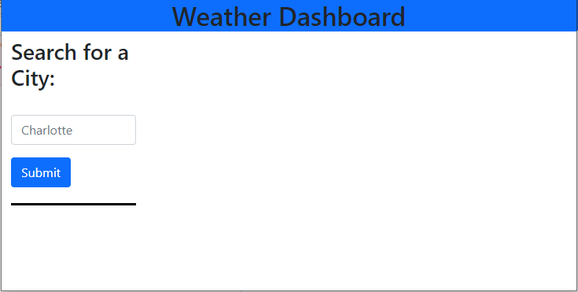

# weather-dashboard

## Table of Contents
- [Description](#Description)
- [Visuals](#Visuals)
- [Link](#Link)

## Description

The weather dashboard take the name of a city in the search box. It will give you the current weather for todays date and also will give you the forecast for the next five days. Every city selected will be saved in the web browswer local storage. To review previous cities just click on the button with that city name and the information will display on the screen again. 

## Visuals

## Link
[Weather Dashboard](https://wparker05.github.io/weather-dashboard//)

